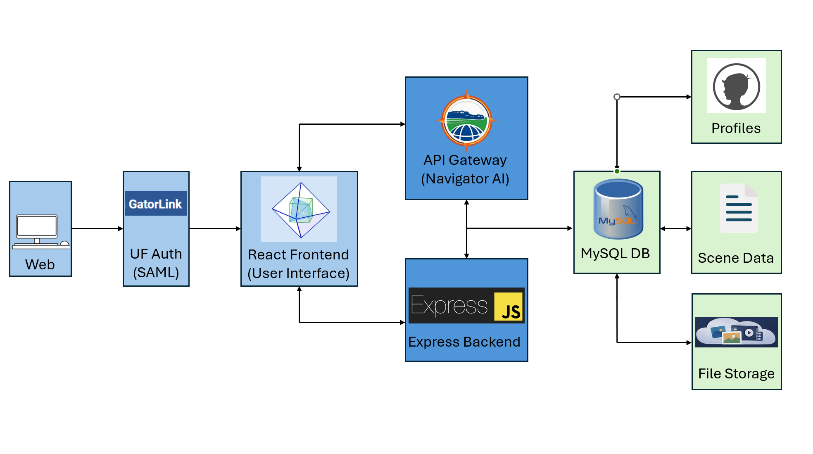

# Event Cruncher Stylus (ECS) – Application Documentation
## Overview
The Event Cruncher Stylus (ECS) is a web-based platform designed to support the creation, organization, and exploration of narrative historical scenes. 

The application allows users to construct structured narratives using a cube-based interface that represents key contextual dimensions of an event:

* Who
* What
* When
* Where
* Why
* How

Each cube face represents a different contextual category, allowing users to attach files, descriptions, and metadata to construct a complete representation of a historical or narrative event.

The system integrates user authentication through the University of Florida authentication service, ensuring that only authorized students and researchers can access the platform.

## System Architecture
The application follows a three-tier web architecture consisting of:
1.	Client Layer (Frontend)
2.	Application Layer (Backend)
3.	Data Layer (Database)

### Client Layer
The frontend is implemented using React and provides the interactive user interface.

Responsibilities include:
•	Rendering the cube-based narrative interface
•	Managing user interactions
•	Sending API requests to the backend
•	Displaying uploaded content and generated scenes

The frontend communicates with the backend through REST API calls.

### Application Layer
The backend server is built using Node.js with Express.js.

This server acts as the central controller of the application and is responsible for:
* Processing API requests from the frontend
* Handling authentication through UF SAML
* Managing user sessions
* Reading and writing cube data
* Processing file uploads
* Coordinating AI-based scene generation

### Authentication
Authentication is handled through SAML integration with the University of Florida authentication system (UF Auth).

This ensures that only verified UF students and faculty members can access the system.

Authentication workflow:
1.	User attempts to log into ECS.
2.	The application redirects the user to the UF SAML authentication service.
3.	The user logs in using their university credentials.
4.	UF Auth verifies the identity and returns a SAML assertion.
5.	The backend validates the assertion and creates a user session.

This authentication model ensures secure access while leveraging the university’s existing identity infrastructure.

### Data Layer
All application data is stored in a MySQL relational database.
The database stores information related to:

* User profiles
* Cube scenes
* Scene metadata
* Uploaded file references
* Cube face content

Each scene can contain multiple cube faces, and each face can contain multiple uploaded files or textual descriptions.

## File Storage
The system supports uploading and attaching media files to cube faces, including:

* Images
* Audio
* Video
* Documents

Uploaded files are stored in server storage and referenced in the MySQL database through file metadata.

## Technology Stack
React

Express.JS

SAML

MySQL

## Software Architecture Diagram
